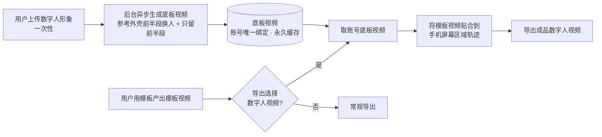
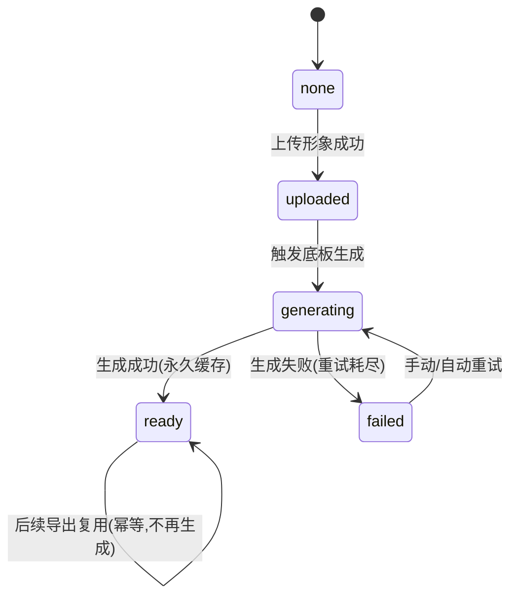

# 数字人矩阵视频导出 · 产品需求文档（PRD）

> 文档类型：功能 PRD ｜ 平台：移动 Web 端（H5） ｜ 灰度范围：白名单账号 ｜ 版本：v0.1（草案，待评审）

---

## 0. 文档信息

| 项 | 内容 |
| --- | --- |
| 需求名称 | 数字人矩阵视频导出（手持手机口播底板 + 模板视频贴片） |
| 需求来源 | 内容矩阵批量分发场景（口播/引流/带货类短视频原生化） |
| 目标平台 | 移动 Web 端（H5，剪辑/模板导出链路） |
| 开放范围 | 白名单账号（Feature Flag 控制） |
| 状态 | 草案 v0.1 · 待产品/技术/法务评审 |
| 一句话价值 | 让用户用模板产出的视频"自动套进一个由本人数字人手持手机展示"的原生化外壳，一次上传形象、永久复用底板、每次导出零感知合成 |

---

## 1. 背景与目标

### 1.1 背景（矩阵玩法）
- **矩阵分发的痛点**：账号矩阵批量发同一支模板视频，容易被平台识别为搬运/低质而限流；纯模板视频缺乏"真人出镜"的原生感。
- **本方案思路**：给模板视频加一层"真人（用户本人数字人）手持手机展示内容"的**原生化外壳**——参考图/参考视频中"一个人举着手机、手机屏幕里播放内容"的形态。用户每换一支模板视频，外壳里的"手机屏幕内容"随之替换，人物（数字人）保持一致。
- **参考素材**：TikTok 参考视频（链接见附录 A）+ 用户提供的示意图（橙色卫衣男士手持手机、手机屏幕内为一段草坪/足球画面）。该参考视频作为**固定底板模板素材**由我方预处理并标注。

### 1.2 目标
1. 白名单用户在移动 Web 端模板导出时，新增导出选项「数字人视频」。
2. 用户仅需**上传一次数字人形象**（与账号唯一绑定），系统**一次性**生成"数字人手持手机"底板视频并**永久绑定、不再重复生成**。
3. 用户每次用模板产出模板视频后，导出时可选「数字人视频」，系统把**模板视频合成到底板视频中手机屏幕的固定位置**，导出成品。
4. 整个数字人底板生成过程对用户**无感**（不暴露独立的"生成数字人"步骤，融入正常导出进度）。

### 1.3 非目标（本期不做，明确划线）
- ❌ 不做数字人**实时驱动/口型同步/语音克隆**（本期底板是固定动作的换脸/换人，不含台词驱动）。
- ❌ 不做**多形象**管理（本期每账号仅 1 个数字人，唯一绑定）。
- ❌ 不做**多套外壳模板**选择（本期外壳=固定参考视频前半段 1 套）。
- ❌ 不做桌面 Web / App 端（本期仅移动 Web）。
- ❌ 不做底板视频的用户可编辑（位置/时长/滤镜等由系统固定）。

---

## 2. 名词定义

| 名词 | 定义 |
| --- | --- |
| 数字人形象 | 用户上传的、用于生成本人替身的素材（人脸照片或短视频），与账号 1:1 唯一绑定 |
| 参考外壳视频 | 我方预置的固定素材（参考 TikTok 视频前半段）：一个人手持手机展示内容的画面 |
| 底板视频（Base Video） | 把参考外壳视频前半段中的人物替换为用户数字人后、仅保留前半段生成的成品；每账号一次性生成、永久复用 |
| 模板视频 | 用户在本产品用模板剪辑产出的视频（即"手机屏幕里要展示的内容"） |
| 贴片/合成 | 把模板视频按固定轨迹贴合到底板视频中"手机屏幕"区域并输出成品的过程 |
| 屏幕区域轨迹 | 底板视频每一帧中手机屏幕四角坐标（含透视/遮挡信息），因外壳固定故可预标注 |
| 白名单 | 被允许使用本功能的账号集合，由 Feature Flag 控制 |
| 无感生成 | 底板生成异步进行、不暴露独立步骤，用户在正常导出流程中无额外操作/等待认知 |

---

## 3. 核心概念：双层合成模型

成品 = **底板层（一次性）** + **贴片层（每次导出）** 的合成。

```
成品视频（数字人视频）
├── 底板层  Base Layer   —— 数字人手持手机（参考外壳前半段换人后）  【每账号一次性生成，永久绑定，不再重复】
└── 贴片层  Insert Layer —— 模板视频贴合到手机屏幕区域              【每次导出实时合成，随模板视频变化】
```

- **底板层**：与账号唯一绑定、幂等、只生成一次；后续所有导出复用同一底板。
- **贴片层**：每次导出用当前模板视频替换"手机屏幕内容"（即示意图中"中间的视频"）。
- **人物一致、内容可变**：数字人（人物）不变，手机屏幕内容（模板视频）每次可变——这正是矩阵玩法所需。

### 3.1 概念示意（Mermaid）



---

## 4. 用户流程

### 4.1 Flow A：首次使用（上传形象 + 无感触发底板生成）
1. 白名单用户在模板导出面板看到新增选项「数字人视频」。
2. 点击后系统判断该账号**是否已绑定数字人形象**：
   - 未绑定 → 弹出上传引导（拍照/相册/短视频），含肖像授权勾选。
   - 上传成功 → 与账号唯一绑定；**后台立即异步触发底板生成**（用户无独立"生成"步骤感知）。
3. 用户可继续/返回；底板生成在后台进行。若用户此时就要导出：见 4.3 的"底板未就绪"分支。

### 4.2 Flow B：底板生成（一次性、异步、幂等、无感）
1. 输入：数字人形象 + 固定参考外壳视频（前半段）+ 预标注的屏幕区域轨迹。
2. 处理：对参考外壳前半段做**人物替换（换脸/换人）** → 只保留前半段 → 产出底板视频。
3. 落库：底板视频与账号 1:1 绑定，状态置 `ready`；**永久缓存，之后永不重复生成**（幂等键=账号+形象版本）。
4. 失败：状态置 `failed`，记录原因，允许有限次自动重试；对用户表现为"稍后可再次尝试导出"。

### 4.3 Flow C：每次导出（实时合成）
1. 用户用模板产出模板视频 → 导出面板选「数字人视频」。
2. 系统取该账号底板视频：
   - `ready` → 进入合成；
   - `generating` → 导出进度条**合并展示**（底板生成进度 + 合成进度），用户仅感知"正在导出"；
   - `none/failed` → 触发/重试底板生成，同上合并展示；仍失败则给出兜底（见 §8.4）。
3. 合成：模板视频按屏幕区域轨迹贴合（透视变换 + 遮挡 + 色彩匹配）→ 输出成品。
4. 导出：成品可下载/分享，进入用户作品/草稿。

---

## 5. 功能需求详述

### 5.1 白名单与入口
| 编号 | 需求 | 说明 |
| --- | --- | --- |
| F-WL-1 | Feature Flag 灰度 | 按账号 ID 命中白名单才展示「数字人视频」选项；非白名单不可见、接口 403 |
| F-WL-2 | 入口位置 | 移动 Web 模板导出面板，作为导出格式/选项之一（与"普通导出"并列） |
| F-WL-3 | 灰度可回收 | 支持随时增删白名单、整体关停（Kill Switch），不影响普通导出 |

### 5.2 数字人形象上传与绑定
| 编号 | 需求 | 说明 |
| --- | --- | --- |
| F-AV-1 | 唯一绑定 | 每账号仅 1 个数字人形象；`account_id → digital_human` 为 1:1 |
| F-AV-2 | 上传方式 | 拍照 / 相册选图 / 短视频（具体入参见 §8.3，MVP 建议单张清晰正脸照） |
| F-AV-3 | 质量校验 | 人脸检测（单人、正脸、清晰度/光照阈值）；不合格即时反馈重传 |
| F-AV-4 | 合规校验 | 肖像授权勾选（必须本人）、内容审核（涉政涉黄涉暴/名人脸拦截） |
| F-AV-5 | 绑定后策略 | 形象一经绑定并生成底板，默认**不可更换**（更换将使旧底板失效、需重生成，见开放问题 Q3） |
| F-AV-6 | 存储与加密 | 生物特征类素材加密存储、最小化留存、可删除（合规见 §10） |

### 5.3 底板视频生成（一次性 · 幂等 · 无感）
| 编号 | 需求 | 说明 |
| --- | --- | --- |
| F-BASE-1 | 触发时机 | 形象上传成功后**立即后台异步触发**；或首次导出时按需触发 |
| F-BASE-2 | 生成内容 | 参考外壳前半段**人物替换为数字人**，**只保留前半段**，输出底板视频 |
| F-BASE-3 | 幂等 | 幂等键=`account_id + avatar_version`；已 `ready` 直接复用，**永不重复生成** |
| F-BASE-4 | 无感 | 不暴露独立"生成数字人"步骤；进度融入导出进度条 |
| F-BASE-5 | 重试与失败 | 有限次自动重试；终态失败记录原因并给用户兜底文案 |
| F-BASE-6 | 存储 | 底板视频 + 元数据（时长、分辨率、屏幕区域轨迹引用）与账号绑定，永久缓存 |

### 5.4 导出合成
| 编号 | 需求 | 说明 |
| --- | --- | --- |
| F-EXP-1 | 合成定义 | 将模板视频贴合到底板"手机屏幕"区域固定轨迹，输出成品 |
| F-EXP-2 | 贴合质量 | 逐帧透视变换（Homography）+ 边缘/手指遮挡处理 + 色彩/亮度匹配 |
| F-EXP-3 | 时长/画幅策略 | 需定义模板视频与底板时长/画幅不一致时的处理（缩放裁切/循环/截断，见 §7.3 与开放问题 Q1） |
| F-EXP-4 | 每次可选 | 每次导出均可选「数字人视频」或普通导出；数字人视频复用同一底板 |
| F-EXP-5 | 音频策略 | 定义成品音频=模板视频原声 / 底板原声 / 混音（默认建议模板视频原声，见开放问题 Q2） |
| F-EXP-6 | 输出规格 | 分辨率/码率/格式与现有导出规格对齐（如 720p/1080p, mp4/H.264） |

### 5.5 状态机（数字人 / 底板）
| 状态 | 含义 | 进入条件 | 可导出数字人视频 |
| --- | --- | --- | --- |
| `none` | 未上传形象 | 初始 | 否（引导上传） |
| `uploaded` | 已上传形象未出底板 | 上传成功 | 否（触发生成） |
| `generating` | 底板生成中 | 触发生成 | 排队，进度合并展示 |
| `ready` | 底板就绪 | 生成成功 | 是（直接合成） |
| `failed` | 底板生成失败 | 生成失败终态 | 否（兜底/重试） |



---

## 6. 交互与 UI（移动 Web）

> 说明：以下为交互规格，视觉稿另出。核心原则=**最少步骤 + 无感生成**。

### 6.1 导出面板
- 在既有"导出"面板中新增卡片/选项「数字人视频」（带 New 标记，仅白名单可见）。
- 点击后按 §5.5 状态分流：`none`→上传引导；`ready`→直接合成导出；`generating/uploaded`→合并进度。

### 6.2 上传引导
- 弹层：示例图（正脸、光线充足）+ 拍照/相册按钮 + 肖像授权勾选（必勾）。
- 校验失败即时提示（如"未检测到清晰人脸，请重试"）。

### 6.3 无感进度
- 统一"正在生成数字人视频…"进度（底板生成 + 合成合并为单条进度）。
- 首次可能较慢（含底板生成），后续导出仅合成、明显更快——文案上不刻意区分，保持"无感"。
- 生成中允许后台化/离开页面后完成通知（若技术支持）。

### 6.4 兜底与异常
- 底板失败：提示"数字人生成暂时失败，可稍后重试或选择普通导出"，保留普通导出出口。
- 合成失败：同上，允许重试。

---

## 7. 关键规则与边界

### 7.1 唯一绑定与幂等
- `account_id ↔ digital_human` 1:1；底板生成幂等键=`account_id + avatar_version`。
- 底板 `ready` 后**永久缓存、永不重复生成**；后续导出仅做合成。

### 7.2 白名单
- 命中白名单才展示与放行；提供 Kill Switch 与逐账号增删。

### 7.3 时长/画幅策略（需产品确认，先给默认建议）
| 场景 | 默认建议策略 | 备注 |
| --- | --- | --- |
| 模板视频 > 底板可视时长 | 手机屏幕区域截取模板视频前 N 秒 / 或成品时长以底板为准 | 见开放问题 Q1 |
| 模板视频 < 底板可视时长 | 循环 / 定格最后一帧 / 底板裁到模板时长 | 见开放问题 Q1 |
| 画幅比例不一致 | 屏幕区域内 `object-fit: cover` 居中裁切 | 保证贴满手机屏幕不留黑边 |

### 7.4 失败降级
- 生成/合成失败：保留普通导出出口，不阻塞主流程；记录错误码用于监控。

---

## 8. 技术方案与架构

### 8.1 总体架构
```
移动Web(H5)
  └─ 导出面板/上传组件
        │  (REST)
        ▼
业务后端(BFF)
  ├─ 白名单/Feature Flag
  ├─ 数字人绑定服务(account↔digital_human)
  ├─ 底板生成任务编排(幂等 + 异步队列)
  └─ 导出合成任务编排
        │
        ├─▶ 换人/换脸生成服务(GPU, 异步)  ── 产出底板视频
        └─▶ 合成引擎(逐帧透视贴合 + 遮挡 + 调色)  ── 产出成品
        │
        ▼
对象存储(OSS/CDN)  ── 数字人形象/底板视频/成品  + 元数据DB
```

### 8.2 关键技术点
| 模块 | 方案要点 | 风险/备注 |
| --- | --- | --- |
| 参考外壳预处理 | 由我方对固定参考视频**离线**完成：裁出前半段、逐帧标注手机屏幕四角坐标+遮挡mask+透视矩阵，作为固定资产入库 | 一次性人工/半自动，成品复用；精度决定贴片质量 |
| 人物替换（底板） | 视频换脸/换人（face swap / avatar 驱动到固定动作模板） | GPU 异步、耗时较长；需评估供应商/自研，见数据缺口 |
| 屏幕区域定位 | 因外壳固定→**预标注轨迹**，运行时不做实时检测，直接读取 | 大幅降低每次导出算力与不确定性 |
| 合成引擎 | 逐帧 Homography 贴合模板视频到屏幕四边形 + 边缘羽化 + 手指遮挡叠加 + 色彩/亮度匹配 | 可用 FFmpeg + OpenCV / 自研；成品质量核心 |
| 异步与幂等 | 消息队列 + 任务表；幂等键去重；进度回传前端 | 保证"无感"与"不重复生成" |
| 存储/CDN | 形象加密、底板永久缓存、成品带过期策略 | 合规与成本平衡 |

### 8.3 数据模型（示意）
| 表 | 关键字段 | 说明 |
| --- | --- | --- |
| `digital_human` | `id, account_id(uniq), avatar_asset_id, avatar_version, status, created_at` | 账号↔数字人 1:1 |
| `base_video` | `id, account_id(uniq), digital_human_id, avatar_version, video_url, screen_track_ref, duration, status, idem_key` | 底板，幂等键唯一 |
| `export_job` | `id, account_id, template_video_id, base_video_id, status, output_url, audio_policy, created_at` | 每次导出合成任务 |
| `whitelist` | `account_id, enabled, updated_at` | 灰度控制 |

### 8.4 接口（示意）
| 接口 | 方法 | 说明 |
| --- | --- | --- |
| `/dh/eligibility` | GET | 是否白名单 + 当前数字人状态（none/uploaded/generating/ready/failed） |
| `/dh/avatar` | POST | 上传数字人形象（含授权），校验通过后绑定并触发底板生成 |
| `/dh/base/status` | GET | 查询底板生成状态/进度 |
| `/dh/export` | POST | 提交导出合成任务（template_video_id + 选项），返回 job_id |
| `/dh/export/{job_id}` | GET | 查询合成进度与成品地址 |

### 8.5 兜底
- 底板 `failed` 或超时：`/dh/export` 返回可降级标识，前端提供"普通导出"出口。

---

## 9. 数据埋点与指标

### 9.1 北极星与核心指标
| 指标 | 定义 | 目的 |
| --- | --- | --- |
| 数字人视频导出成功率 | 成功成品 / 选择数字人视频次数 | 质量与稳定性 |
| 首次底板生成成功率 | ready / 触发生成 | 生成服务健康度 |
| 首次底板生成时长 P50/P90 | 端到端耗时 | "无感"体验 |
| 每次合成时长 P50/P90 | 复用底板后的合成耗时 | 复用价值验证 |
| 形象上传转化率 | 上传成功 / 进入上传引导 | 入口/合规摩擦 |
| 数字人视频渗透率 | 选数字人视频 / 白名单总导出 | 需求验证 |

### 9.2 关键埋点
| 事件 | 触发点 | 关键属性 |
| --- | --- | --- |
| `dh_entry_show` | 展示「数字人视频」选项 | account_id, dh_status |
| `dh_avatar_upload` | 上传结果 | success, fail_reason |
| `dh_base_generate` | 底板生成开始/结束 | status, duration_ms, retry_cnt |
| `dh_export` | 合成开始/结束 | status, duration_ms, template_id, audio_policy |
| `dh_fallback` | 触发普通导出兜底 | from_status, reason |

---

## 10. 合规与风控

| 项 | 要求 |
| --- | --- |
| 肖像授权 | 上传前必须勾选"确认为本人/已获授权"，留痕（时间戳+版本） |
| 内容审核 | 形象与成品均过审核（涉政涉黄涉暴、名人脸/公众人物拦截） |
| 生物特征合规 | 人脸类素材加密、最小化留存、可删除；符合当地个人信息保护法规 |
| 深度合成标识 | 成品按监管要求添加合成内容标识/水印（如适用） |
| 数据删除 | 用户注销/解绑时删除形象与底板，遵循留存策略 |

---

## 11. 分期与里程碑（按范围划分，不按日历时间）

| 阶段 | 范围 | 交付判据 |
| --- | --- | --- |
| P0（MVP） | 单形象唯一绑定 + 固定外壳 1 套 + 白名单 + 无感底板生成 + 单一时长/画幅策略 + 基础埋点 | 白名单用户可完成"上传→无感生成底板→导出数字人视频"闭环 |
| P1 | 生成/合成质量优化（遮挡、调色）、时长/画幅策略可配、失败重试体验、通知 | 成功率与生成时长达标；兜底完善 |
| P2（非目标预留） | 多形象/多外壳模板/口型驱动等 | 视 P0/P1 数据决定是否投入 |

---

## 12. 开放问题 / 待确认（追问清单）

> 均为影响 P0 实现且需业务/技术决策的关键点，附理由。

1. **成品时长与结构（最高优先级）**：需求"只保留前半段"——成品是否 = 仅"数字人手持手机（内含模板视频画面）"的前半段？还是"前半段手持镜头 + 后接全屏模板视频"？两者对合成管线、时长策略、观感差异很大。→ *理由：决定合成引擎输出结构与 §7.3 时长策略，是 P0 的地基。*
2. **音频策略**：成品音频用模板视频原声 / 底板环境声 / 混音？→ *理由：影响观感与合成实现，且矩阵引流常依赖口播/BGM。*
3. **形象更换与底板失效**：是否允许更换数字人形象？更换后旧底板作废并重生成的规则与成本如何？→ *理由：涉及"唯一绑定+永不重复生成"与用户预期的边界。*
4. **参考外壳授权与固定性**：参考 TikTok 视频作为固定外壳素材，版权/肖像授权是否已获得？是否需替换为我方自制外壳？→ *理由：合规红线，且外壳需我方预标注。*

---

## 13. 数据缺口（查不到 / 待补）

- **生成服务能力与成本**：视频换人/换脸供应商或自研方案的清晰度、单次生成时长、GPU 单价与并发上限——决定"无感"是否成立及成本模型，**待技术选型补齐**。
- **参考视频精确内容**：TikTok 参考链接（附录 A）前半段的确切时长、镜头运动、手机屏幕在画面中的轨迹与遮挡情况，需拿到原片后逐帧标注，**当前基于用户示意图与描述，属待核**。
- **现有导出规格**：现网移动 Web 导出的分辨率/码率/格式/时长上限，需对齐产研现状，**待补**。
- **白名单规模与并发**：初期白名单账号数与预计导出峰值，决定队列与算力预算，**待补**。

---

## 14. 特殊条件声明

- 本方案的"**无感**"体验高度依赖**换人生成服务的速度与稳定性**：若单次底板生成耗时过长或失败率高，则需退化为"显式生成进度 + 通知"体验，且"无感"目标不成立。
- "**永不重复生成、永久复用底板**"依赖**外壳与形象均固定**：一旦允许更换形象或多套外壳，幂等假设与成本模型需重估。
- "**预标注屏幕轨迹**（运行时不实时检测）"依赖**外壳视频固定**：若外壳改为用户可选或动态，则需引入实时屏幕检测/跟踪，算力与不确定性显著上升。
- 合规（肖像授权、深度合成标识、参考素材版权）为**硬约束**：任一不满足则功能不可上线。

---

## 附录 A：参考素材
- 参考视频（用户提供）：`https://www.tiktok.com/t/ZTA7Uxq1f/`（形态：真人手持手机、手机屏幕内播放内容；本方案取其"前半段手持展示"形态作为外壳）。
- 用户示意图：橙色卫衣男士手持手机、手机屏幕内为草坪/足球画面——对应"人物=数字人（每账号固定）、手机屏幕内容=模板视频（每次可变）"的双层模型。
